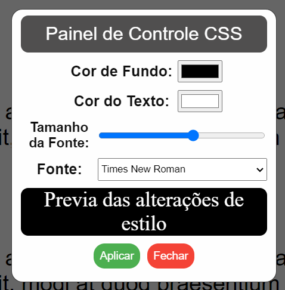

# Painel de controle CSS
 #### **Um painel de controle CSS que permite aos usuários controlar o estilo dos elementos da página**

- A ideia por trás deste projeto surgiu com a pergunta: E se os usuários pudessem controlar os estilos dos elementos da página? 
- Este é um projeto de laboratório destinado a aprimorar minhas habilidades, portanto, pode não haver atualizações
- Sinta-se à vontade para usar este repositorio como quiser e contribuir com melhorias, abrindo issues ou pull requests.

#### Preview:

  

- Este código é fornecido sob a licença MIT.